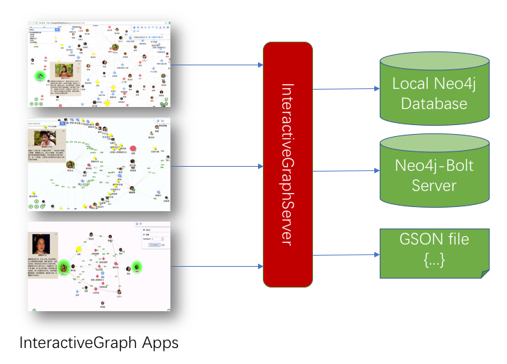
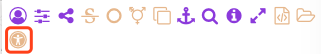

# InteractiveGraph-neo4j

[](https://github.com/grapheco/InteractiveGraph-neo4j/releases)
[](https://github.com/grapheco/InteractiveGraph-neo4j/releases)
[](https://github.com/grapheco/InteractiveGraph-neo4j/issues)
[](https://github.com/grapheco/InteractiveGraph-neo4j/network)
[](https://github.com/grapheco/InteractiveGraph-neo4j/stargazers)
[](https://github.com/grapheco/InteractiveGraph-neo4j/blob/master/LICENSE)

InteractiveGraph-neo4j serves GSON files(see https://github.com/grapheco/InteractiveGraph#GSON), Neo4j databases, RDF stores as `InteractiveGraph` providers, it generates `InteractiveGraph`s for remote frontend `InteractiveGraph` clients on demand. Known `InteractiveGraph` clients includes GraphNavigator, GraphBrowser, and RelFinder (see https://github.com/grapheco/InteractiveGraph).

The interaction architecture looks like:


# Quick Start

1. download latest `graphserver.war` and `igraph.war` file from release page: https://github.com/grapheco/InteractiveGraph-neo4j/releases

`graphserver.war`: graph server app
`igraph.war`: interactive graph clients, including GraphNavigator, GraphBrowser, and RelFinder.

1. move war files into your `webapps` folder of Web server (Tomcat, for example)

1. start Web server, we assume the web app url is http://yourhost:8080

1. explore InteractiveGraph/GraphBrowser in Web browser:
```
http://yourhost:8080/igraph/example12.html
```

# Accessing servers in InteractiveGraph apps

1. If you are using a remote graph app, GraphBrowser, for example. To access IGP servers, you may click the `load remote IGP server` tool, in the dialog input connector url like: `http://yourhost:8080/graphserver/connector-gson`, InteractiveGraph/GraphBrowser will load and visualize graph from graphserver.



1. To access IGP servers programmly, you may use `app.connect()` method. Here is an example:
```
    var app = new igraph.GraphNavigator(document.getElementById('graphArea'));
    app.connect("http://yourhost:8080/graphserver/connector-neodb");
```

NOTE: `graphserver` provides 3 servlets: `/connector-gson`, `/connector-bolt`, `/connector-neodb`. Because the `/connector-bolt` depends on `/connector-neodb`, so note that `/connector-neodb` should be accessed before accessing `/connector-bolt`.

# Configuration

InterativeGraphServer is able to connect several kinds of backend data sources: `neo4j-gson`, `neo4j-db`, `neo4j-bolt`.

## web.xml

`ConnectorServlet`s should be defined in web.xml. Each servlet requires a `configFile` parameter:

```
    <servlet>
        <servlet-name>connector3</servlet-name>
        <servlet-class>org.interactivegraph.server.ConnectorServlet</servlet-class>
        <init-param>
            <param-name>configFile</param-name>
            <param-value>WEB-INF/conf3.properties</param-value>
        </init-param>
    </servlet>
    <servlet-mapping>
        <servlet-name>connector3</servlet-name>
        <url-pattern>/connector-gson</url-pattern>
    </servlet-mapping>
```

Here, a `connector1` is defined with a configuration file `conf3.properties`, it responds to clients when requested as `http://yourhost/graphserver/connector-gson`.

<a href='web/WEB-INF/web.xml'>example web.xml</a>

## configuration file

Configuration files are written in properties file format, there are some common properties and other specific properties according to different backend kinds.

### common properties
|name|description|type|example|
|-|-|-|-|
|allowOrigin|allowed domains, `*` means allow all remote clients|string|`http://192.168.1.1:8080` |
|backendType|backend source type|one of `neo4j-gson`, `neo4j-bolt` or `neo4j-db` | neo4j-gson |
|neo4j.nodeCategories|categories of nodes in name/title pair format|  | person:人物,event:事件,location:地点 |
|visNodeProperty.label|an expression to be evaluated as caption of a visualized node|string as a VelocityExpr, if it starts with a `=` then it is a Velocity expression, else it is a Velocity template, see http://velocity.apache.org/engine/devel/vtl-reference.html| `=$prop.name`, or `#if($prop.name) $prop.name #else <empty> #end`|
|visNodeProperty.value|an expression to be evaluated as value (size) of a visualized node | string as a VelocityExpr | `=$prop.value` |
|visNodeProperty.image|an expression to be evaluated as path of image of a visualized node | string as a VelocityExpr | `=$prop.image`, or `http://.../images/${prop.id}` |
|visNodeProperty. info|an expression to be evaluated as HTML-formated infomation (description in detailed) of a visualized node | string as a VelocityExpr | `<p align=center> #if($prop.image) <br> #end <b>${prop.name}[${prop.id}]</b></p><p align=left>${node.info}</p>` |
|neo4j.regexpSearchFields|fields used to perform a full text search|string array sperated by , | name,address |
|neo4j.strictSearchFields|strict match fields mapping|array of : sperated pairs, for example: `label:name`, this tells search information in `name` property when asked to search in `label` property,   | label:name |

#### backendType=neo4j-bolt

|name|description|type|example|
|-|-|-|-|
|neo4j.boltUrl|url of bolt server|string|`bolt://localhost:7688` |
|neo4j.boltUser|user acount|string | admin |
|neo4j.boltPassword|user password|string | admin |

<a href='web/WEB-INF/conf1.properties'>example properties file</a>

#### backendType=neo4j-db

|name|description|type|example|
|-|-|-|-|
|neo4j.dataDir|file path of a neo4j database, often in `<neo4j-home>/data/databases/` |string | `WEB-INF/databases/data.db` |
|neo4j.boltPort|a bolt server will be startup on the database, this parameter specify the port of bolt server|number | 7689 |

<a href='web/WEB-INF/conf2.properties'>example properties file</a>

#### backendType=neo4j-gson

|name|description|type|example|
|-|-|-|-|
|gson.path|relative/abslute path of GSON file|string|`WEB-INF/honglou.json` |
|gson.tempDir|a temporary database will be created for the GSON file, this parameter specify where we create the database |string | `/dev/shm`, or `/tmp` |
|neo4j.boltPort| a bolt server will be startup on the temporary database, this parameter specify the port of bolt server | 7689 |

<a href='web/WEB-INF/conf3.properties'>example properties file</a>
